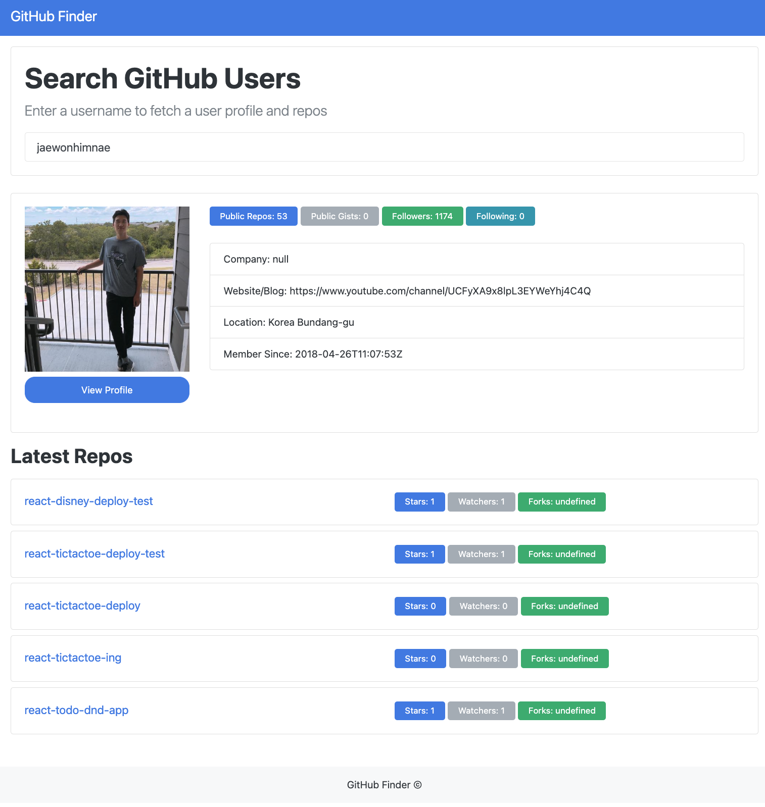

# 자바스크립트를 이용해서 github finder 앱 만들기
### 수행 기간
- 20231027~20231031(영업일 기준 3일)
### 결과물
- 아래 리소스 형상(manifest)이 올라간 결과물 레포 주소(URL 제출)

### 하위과제
- 자바스크립트 OOP를 이용해서 구현합니다
- 비동기 통신을 이용합니다
- 위에 기능 외에 잔디밭 기능, Spinner 기능 등 원하는 기능을 추가해봅니단